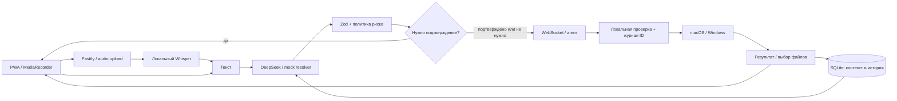

# Рядом — голосовой помощник для Mac и Windows

Рабочий TypeScript MVP: устанавливаемая PWA на телефоне записывает короткую команду, отдельный локальный Whisper распознаёт речь, DeepSeek выбирает типизированное действие, а Mac-агент выполняет его после локальной проверки. Есть полностью автономный mock-режим без API-ключей и без реальных системных действий.

## Быстрый старт

Требуются **Node.js 24+**, **pnpm 11.9+**. Для mock-режима Python и Whisper не нужны. Запускайте команды из корня этого проекта.

```bash
pnpm install
pnpm dev
```

Первый запуск создаёт `.env` со случайным bootstrap-секретом и копирует примеры реестра в `data/`. Откройте **http://localhost:5173**, введите восьмизначный код из терминала Mac-агента. Введите «Давай поработаем над OTP»: появится `Mock: Открыт проект Cascade OTP`.

В mock-режиме браузер действительно записывает и отправляет аудио, но STT всегда возвращает `MOCK_TRANSCRIPT` (по умолчанию команду про OTP). Для проверки разных фраз используйте текстовое поле. Это ограничение явно показано в интерфейсе.

Код одноразовый и действителен 5 минут. Новый код: перезапустите агент. Каждому браузеру выдаётся отдельный токен в HttpOnly-cookie. Секрет из `.env` в телефон вводить не нужно.

## Команды проекта

| Команда                  | Назначение                                                    |
| ------------------------ | ------------------------------------------------------------- |
| `pnpm install`           | Все JS-зависимости, lockfile включён                          |
| `pnpm dev`               | PWA + сервер + Mac-агент, автоматическая подготовка `.env`    |
| `pnpm dev:pwa`           | Vite на 5173                                                  |
| `pnpm dev:server`        | Backend на 8787                                               |
| `pnpm dev:agent`         | Mac-агент, новый код привязки                                 |
| `pnpm setup:env`         | Подготовить конфигурацию без запуска                          |
| `pnpm setup:stt`         | Установить локальный Whisper и заранее загрузить модель       |
| `pnpm setup:stt --check` | Проверить установленный STT без загрузки                      |
| `pnpm lint`              | ESLint                                                        |
| `pnpm typecheck`         | Проверка всех TypeScript-пакетов                              |
| `pnpm test`              | Unit + интеграционные тесты, реальные localhost WebSocket     |
| `pnpm build:agent`       | Собрать macOS-бинарник `dist/macos/dauys-agent`               |
| `pnpm start`             | Собранное приложение: PWA на 8787 + агент                     |
| `pnpm test:browser`      | Браузерная проверка при работающем `pnpm dev`                 |
| `node scripts/smoke.mjs` | Health + привязка + текстовая команда через работающий сервер |

Для браузерных тестов используется установленный Google Chrome на macOS. Если его нет, установите браузер тестов: `pnpm exec playwright install chromium`. Тест запускает Chromium в размере iPhone с тестовым аудиоустройством, проверяет MediaRecorder, 20-секундный лимит и отказ в доступе. Это не заменяет проверку физического iPhone/Safari.

После изменения серверных исходников или `.env` перезапустите соответствующий процесс. Vite обновляет интерфейс автоматически.

## Mac-агент как программа

На телефоне открывайте **https://dauys.esl.kz**. На Mac соберите и поставьте агент один раз:

```bash
pnpm build:agent
# или явно: pnpm build:agent:macos
dist/macos/install.sh
```

Агент ставится в `~/Applications/DauysAgent/`, стартует при входе в систему и сам поднимается после сбоя. Данные — в `~/Library/Application Support/DauysAgent/`, логи — `~/Library/Logs/dauys-agent.log`.

При первом запуске появится диалог секрета (`AGENT_BOOTSTRAP_SECRET` с сервера) и диалог с 8-значным кодом. Код введите на https://dauys.esl.kz. Дальше секрет не нужен.

```bash
~/Applications/DauysAgent/dauys-agent --reset   # новая привязка
~/Applications/DauysAgent/dauys-agent --pair    # новый код
dist/macos/uninstall.sh                         # остановить
dist/macos/uninstall.sh --purge                 # ещё и стереть токен
```

## Windows-агент

Тот же сервер и PWA; на ПК ставится локальный агент (Windows 11 x64).  
Пошаговая инструкция: `packaging/windows/BUILD-ON-WINDOWS.md` (сборка → тест → production).  
Кратко: `packaging/windows/INSTALL.md`.  
Архив для переноса на Windows: `pnpm pack:windows-transfer` → `dist/windows-transfer/*.zip`.  
Комплект install-скриптов без `.exe`: `pnpm pack:windows-kit`.

### Вариант A — SEA-бинарник (только на Windows 11 x64, Node 24+)

```powershell
pnpm install
pnpm build:agent:windows
cd dist\windows
powershell -ExecutionPolicy Bypass -File .\install.ps1
```

Бинарник: `%LOCALAPPDATA%\DauysAgent\bin\dauys-agent.exe`.  
Данные и токен: `%LOCALAPPDATA%\DauysAgent\` (ACL только для текущего пользователя).  
Автозапуск: ярлык в папке Startup пользователя (не служба Windows).  
Удаление: `uninstall.ps1` или `uninstall.ps1 -Purge`.

### Вариант B — из репозитория (Node ≥24)

```powershell
pnpm install
copy .env.windows-work.example .env
# SERVER_PUBLIC_URL / AGENT_BOOTSTRAP_SECRET тестового сервера
# ALLOW_REAL_ACTIONS=true
# ALLOWED_DIRECTORIES=C:/Users/YOU/Documents,C:/Users/YOU/Downloads,C:/Users/YOU/Projects
# config/registry.windows.example.json → data-windows-work/registry.json (пути к .exe)
pnpm dev:agent
```

На Windows у каждого приложения в реестре нужен полный путь к `.exe`. Пример: `config/registry.windows.example.json`.  
`run_shortcut` на Windows — только id из `agent-trust.json` с записью в `processes` (не macOS Shortcuts).

Smoke на Windows после привязки телефона: «Открой Telegram», «Открой проект …», «Какой заряд батареи» (на ПК без батареи — нормальный ответ).

## Структура и архитектура

```text
apps/pwa/         React, MediaRecorder, настройки, manifest, service worker
apps/server/      Fastify, pairing, pipeline, DeepSeek, STT, SQLite
apps/mac-agent/   Агент Mac/Windows: WS, политика, адаптеры ОС, журнал ID
packages/shared/  Zod-схемы действий, сообщений и реестра
config/           примеры проектов (в т.ч. registry.windows.example.json)
packaging/        macos/, windows/ install/uninstall
scripts/          запуск, подготовка .env, установка STT, сборка агента, smoke
tests/            unit, integration, browser
data/             приватные токены, БД, реестр, локальные снимки экрана
docs/             API и заметки о проверках
```



SQLite используется через встроенный `node:sqlite` из Node 24, чтобы избежать сборки нативного `better-sqlite3`. В этой версии Node возможен стандартный `ExperimentalWarning`; тесты проверяют фактическую работу базы. Данные не хранятся только в памяти.

Отчёт о фактических проверках: [docs/VERIFICATION.md](docs/VERIFICATION.md).

Подробнее: [ARCHITECTURE.md](ARCHITECTURE.md), [SECURITY.md](SECURITY.md), [docs/API.md](docs/API.md).

## Реальное открытие без DeepSeek

Для команд открытия облачный ключ не обязателен. Режим `INTENT_PROVIDER=local` использует локальные правила и псевдонимы, а `STT_PROVIDER=local` распознаёт настоящую запись через Whisper. Также поддерживается `STT_PROVIDER=parakeet` с NVIDIA Parakeet. При `ALLOW_REAL_ACTIONS=true` (или совместимом `ALLOW_REAL_MAC_ACTIONS=true`) агент действительно открывает приложения и проекты.

```dotenv
INTENT_PROVIDER=local
STT_PROVIDER=local
ALLOW_REAL_ACTIONS=true
```

На этом Mac эти настройки уже включены, добавлены Cursor, Telegram, Safari, Chrome, WhatsApp, Discord и существующие проекты BetGPT, BetGPT Mobile, «Голосовой помощник». Пути находятся в приватном `data/registry.json`; прежняя конфигурация сохранена в `data/before-real-mode/`. Для переноса на другой Mac или Windows настройте реальные пути и `ALLOWED_DIRECTORIES`.

Примеры: «Открой Telegram», «Открой проект бет в курсоре», «Открой мобильный проект в Cursor», «Открой помощник в курсоре». Открытие проекта не запускает его сервер. Локальный режим требует узнаваемого имени/псевдонима; неизвестное или неоднозначное название вызывает уточнение. Он не заменяет свободное понимание языка через DeepSeek. Подтверждения опасных действий сохраняются.

Проверка, которая **действительно открывает приложения** (только по явному флагу):

```bash
RUN_REAL_OPENING_TESTS=1 pnpm exec playwright test tests/browser/real-opening.spec.ts
```

Обычный браузерный mock-сценарий автоматически пропускается при включённых реальных действиях, чтобы тест блокировки экрана не заблокировал рабочий компьютер.

## Реальный режим

Сначала настройте проекты и разрешённые каталоги. Затем:

```bash
pnpm setup:stt
```

В `.env`:

```dotenv
INTENT_PROVIDER=deepseek
DEEPSEEK_API_KEY=ваш_ключ
DEEPSEEK_BASE_URL=https://api.deepseek.com
DEEPSEEK_MODEL=идентификатор_модели_из_вашего_аккаунта
STT_PROVIDER=parakeet
PARAKEET_MODEL=nvidia/parakeet-tdt-0.6b-v3
PARAKEET_PYTHON=./.venv/bin/python
ALLOW_REAL_MAC_ACTIONS=true
ALLOWED_DIRECTORIES=/Users/ваше_имя/Documents,/Users/ваше_имя/Downloads,/Users/ваше_имя/Projects
```

Перезапустите `pnpm dev`. Название модели DeepSeek **полностью настраивается**, намеренно не выбирается неявно. Возьмите актуальный ID в [официальной документации DeepSeek](https://api-docs.deepseek.com/). Интеграция использует OpenAI-совместимый SDK, `response_format: {type: "json_object"}`, обязательную Zod-валидацию и один повтор при неверной структуре. См. [JSON Output](https://api-docs.deepseek.com/guides/json_mode/).

Установите Parakeet командой `pnpm setup:parakeet`; она загружает официальный Transformers runtime и веса модели заранее. Без ключа или ID модели DeepSeek команда завершится ошибкой. Провайдеры независимы: можно использовать Whisper или Parakeet с локальным либо DeepSeek-интерпретатором.

**Аудио не отправляется в DeepSeek.** В DeepSeek уходят транскрипция, реестр, сведения о разрешённых инструментах, найденные имена/пути файлов и недавний контекст. Содержимое файлов не читается и не отправляется.

## Whisper на Apple Silicon

Адаптер использует [mlx-whisper](https://github.com/ml-explore/mlx-examples/tree/main/whisper). Setup определяет macOS/arm64, проверяет FFmpeg и Python, создаёт `.venv`, устанавливает пакет и делает пробный запуск модели на тишине. Короткое имя `small` превращается в `mlx-community/whisper-small-mlx`; можно указать полный Hugging Face ID совместимой MLX-модели.

Если отсутствуют системные зависимости, скрипт выдаёт точную команду и ничего не устанавливает через sudo:

```bash
brew install ffmpeg python@3.12
pnpm setup:stt
```

Python 3.12 предпочтителен для совместимости; скрипт также обнаруживает доступные 3.13/3.x. При несовместимых пакетах создайте `.venv` Python 3.12 и повторите setup. Начальная загрузка модели требует интернета и свободного места; дальнейшая транскрибация выполняется локально. Кэш модели принадлежит Hugging Face и не является сохранёнными пользовательскими аудиозаписями.

Загрузка аудио ограничена 8 MiB. FFmpeg нормализует поддержанные браузерные форматы в mono PCM WAV 16 kHz и обрезает до 20 секунд. Временные upload/WAV-каталоги удаляются в `finally`, включая ошибки и отмену. При принудительном завершении процесса или отключении питания возможны остатки в системной temp-папке; они не публикуются через HTTP.

На Intel/Linux используйте mock или запускайте backend с локальным STT на Apple Silicon. MLX нельзя исполнять в обычном Linux-контейнере; Docker-конфигурация явно выбирает mock STT.

## Проекты, приложения и сценарии

Откройте кнопку настроек в правом верхнем углу. Здесь можно добавлять/редактировать проекты, абсолютные пути, URL, приложения и псевдонимы. Реестр хранится в `data/registry.json`; его также можно редактировать локально. Не меняйте конфигурацию во время незавершённой команды.

Пример Cascade из `config/registry.example.json` содержит фиктивный путь `/Users/USERNAME/Projects/cascade`. **Замените его реальным существующим путём** и добавьте родительский каталог в `ALLOWED_DIRECTORIES` именно на Mac-агенте. Cursor должен быть установлен, либо выберите другое зарегистрированное приложение. В `.env.example` нет путей, привязанных к автору проекта.

Псевдонимы и описания отправляются модели, поэтому «каскад», «OTP» и «сервис авторизации» могут обозначать один проект. Успешное открытие сохраняет активный проект: «Запусти его» выбирает `start_work`; «И открой сайт» использует URL проекта.

Сценарии состоят из типизированных шагов. В интерфейсе есть дополнительный JSON-редактор шагов, вложенные сценарии запрещены. Изменение сайта проекта не переписывает явно заданные URL шагов — их можно отредактировать отдельно.

**Команды процессов никогда не приходят от модели или из PWA.** Только локальный `data/agent-trust.json` содержит процессы и разрешённые Shortcuts:

```json
{
  "shortcuts": [{ "id": "focus", "name": "Рабочий фокус" }],
  "processes": {
    "cascade-otp__start_work": {
      "executable": "/opt/homebrew/bin/pnpm",
      "args": ["dev"],
      "cwd": "/Users/USERNAME/Projects/cascade"
    }
  }
}
```

Проверьте путь через `command -v pnpm`. Ключ процесса — `<projectId>__<scenarioId>`. После изменения доверенной конфигурации перезапустите агент. Сценарий сначала выполняет шаги, затем запускает процесс; при ошибке прекращает следующие шаги. Результат содержит итоги каждого шага. Подтверждение обязательно для всех сценариев. Запуск процесса означает успешный spawn, а не готовность веб-сервера; процесс остаётся работать на Mac и управляется локально. Автоматический откат шагов не выполняется.

Разрешайте только собственные проверенные Shortcuts и процессы: их содержимое является доверенным локальным кодом. Не добавляйте автоматизации для запрещённых задач; приложение не анализирует внутреннее содержимое Shortcut.

## Поддерживаемые действия

| Действие                 | Пример                         | Подтверждение                       |
| ------------------------ | ------------------------------ | ----------------------------------- |
| open_application         | «Открой Telegram»              | Нет                                 |
| close_application        | «Закрой Cursor»                | Да                                  |
| open_project             | «Давай поработаем над OTP»     | Нет                                 |
| search_files / open_file | «Открой последнюю презентацию» | Выбор при неоднозначности           |
| open_folder              | «Открой папку проекта»         | Нет, только разрешённые каталоги    |
| open_url                 | «Открой сайт проекта»          | Нет, только HTTP(S) без credentials |
| run_shortcut             | «Запусти рабочий фокус»        | Да, только локальный реестр         |
| set_volume               | «Громкость на 40»              | Нет                                 |
| media_play_pause         | «Поставь музыку на паузу»      | Да; управление Music                |
| take_screenshot          | «Сделай скриншот»              | Да; сохраняется только на Mac       |
| get_battery_status       | «Сколько заряда?»              | Нет                                 |
| get_active_application   | «Что сейчас открыто?»          | Нет                                 |
| lock_screen              | «Заблокируй экран»             | Да                                  |
| run_scenario             | «Запусти его»                  | Да                                  |

Mock-интерпретатор демонстрирует псевдонимы, контекст, проекты, сайты, поиск документов, батарею, громкость, закрытие, блокировку, музыку и скриншот. Он детерминирован и не заменяет понимание произвольного языка в DeepSeek-режиме.

Spotlight ищет часть имени, расширение, PDF/презентации и фильтрует дату изменения. Результаты сортируются по новизне; максимум 10. Для «последнего» открывается первый. Несколько результатов → кнопки выбора; «Первую» голосом или текстом продолжает исходный ID команды. Поиск более 3000 кандидатов требует сузить запрос. Скрытые файлы, скрипты, пакеты `.app` и пути через симлинк за пределы разрешённых каталогов отклоняются.

## Телефон, HTTPS и установка PWA

### 1. На компьютере

`pnpm dev` → `http://localhost:5173`. `localhost` считается безопасным контекстом, микрофон работает после разрешения браузера. После `pnpm build && pnpm start` production PWA доступна на `http://localhost:8787`, включая service worker.

### 2. Телефон в той же Wi-Fi сети

IP Mac можно узнать в настройках Wi-Fi. Обычный `http://192.168.x.x:5173` подходит только для просмотра и текстовых команд: **микрофон на телефоне требует HTTPS**. Добавьте точный используемый origin в `PWA_ORIGIN` (через запятую для нескольких) и перезапустите backend.

Для записи поднимите HTTPS reverse proxy с сертификатом, которому доверяет телефон, например Caddy с локальным CA или сертификатом, созданным mkcert. Установите CA-профиль на iPhone и включите полное доверие в «Настройки → Основные → Об этом устройстве → Доверие сертификатам». После проверки можно удалить профиль. Сертификат должен включать имя/IP, по которому открывается сайт.

Сначала `pnpm build && pnpm start`. Пример Caddy для LAN:

```caddyfile
https://192.168.1.10:8443 {
    tls internal
    reverse_proxy 127.0.0.1:8787
}
```

Используйте фактический IP. В `.env`: `PWA_ORIGIN=https://192.168.1.10:8443`, `COOKIE_SECURE=true`. `SERVER_PUBLIC_URL=http://localhost:8787` можно оставить для агента на том же Mac. Телефон обращается к API и WebSocket по своему origin; адрес backend в исходниках PWA менять не требуется.

### 3. HTTPS-туннель или собственный сервер

Соберите PWA и направьте HTTPS reverse proxy/туннель **на порт 8787** с поддержкой WebSocket. Можно использовать Caddy/Nginx на собственном домене, SSH reverse tunnel с TLS на внешнем сервере, Cloudflare Tunnel, ngrok или иной подходящий сервис. Платный провайдер не обязателен. Не публикуйте Vite dev-server в интернете.

В `.env`: `PWA_ORIGIN=https://assistant.example.com`, `COOKIE_SECURE=true`. Если backend и агент на одном Mac, агент может продолжать использовать localhost. Если агент подключается к удалённому backend, задайте ему `SERVER_PUBLIC_URL=https://assistant.example.com`; используйте WSS. Для настоящего MLX STT сервер распознавания должен работать на Apple Silicon. Этот MVP не содержит отдельного удалённого STT-сервиса.

Прокси должен передавать Cookie и WebSocket Upgrade, сохранять Origin и ограничивать размер upload. Backend не доверяет произвольным `X-Forwarded-For`; лимит за прокси применяется к его IP. Не выставляйте bootstrap-секрет, токен агента или `.env` в статический каталог.

На iPhone откройте адрес в Safari → «Поделиться» → «На экран Домой». На Android — Chrome → «Установить приложение». При первом нажатии разрешите микрофон. Manifest, PNG-иконки, safe-area, mobile meta tags и service worker включены. Офлайн кэшируется интерфейс; команды без сервера не выполняются и не ставятся в очередь.

## Разрешения macOS

Выдавайте разрешение тому приложению, из которого работает Node (Terminal, iTerm или IDE):

- **Автоматизация**: управление System Events, Music и приложениями при закрытии.
- **Универсальный доступ**: блокировка через сочетание Control–Command–Q и системная автоматизация.
- **Запись экрана**: `take_screenshot`; файл остаётся в `data/screenshots/` и не передаётся на телефон.
- **Файлы и папки**: доступ к выбранным Documents/Downloads. Full Disk Access по умолчанию не требуется.
- **Микрофон**: Safari/Chrome на устройстве записи; самому Mac-агенту микрофон не нужен.

Путь: «Системные настройки → Конфиденциальность и безопасность». Ошибка разрешения возвращается в PWA вместе с инструкцией, агент продолжает работать. Иногда после выдачи разрешения нужно перезапустить терминал. Приложение с несохранённым документом может запросить дополнительное подтверждение непосредственно на Mac.

## Безопасность и ограничения MVP

Один доверенный Mac и связанные с ним телефоны образуют личное пространство. Это не многопользовательский облачный сервис. Любой привязанный телефон может менять реестр и отзывать устройства этого пространства. Только инициатор команды может читать её endpoint и подтверждать её; общая история пространства доступна связанным устройствам.

Реальные действия отключены по умолчанию. Команда живёт максимум 60 секунд, включая распознавание/уточнение/подтверждение. Неподтверждённая опасная команда отклоняется и сервером, и агентом. Каждый отправляемый шаг имеет отдельный UUID, который агент записывает в SQLite **до выполнения**. После разрыва соединения шаг не пересылается: результат может быть неизвестен, проверьте Mac перед повтором.

Удаление файлов, сообщения/письма, покупки, пароли, Keychain, передача файлов наружу, произвольный shell/AppleScript, изменения системных настроек и повышение привилегий не имеют доступных инструментов. Вызовы macOS используют `execFile`/`spawn` с массивами аргументов и без shell. Подробнее о границах защиты: [SECURITY.md](SECURITY.md).

Отмена записи уничтожает аудио без отправки. Отмена серверной команды возможна до отправки на Mac; уже выполняемое системное действие не откатывается. Из-за гонки сети при прерывании HTTP-запроса сервер мог успеть принять команду — состояние можно увидеть в истории.

## Типовые проблемы

| Симптом                         | Решение                                                                                   |
| ------------------------------- | ----------------------------------------------------------------------------------------- |
| MacBook не в сети               | Проверить, что агент запущен (`launchctl print gui/$(id -u)/com.dauys.agent` или `pnpm dev:agent`), SERVER_PUBLIC_URL, сон Mac, firewall |
| Код истёк / использован         | `dauys-agent --pair` или перезапустить агент; 5 попыток привязки в минуту                  |
| Доступ отозван                  | Телефон привязать заново; для агента `dauys-agent --reset` (создаёт новую identity)        |
| Ошибка Origin                   | Добавить точный адрес страницы с протоколом и портом в PWA_ORIGIN                         |
| После привязки снова экран кода | Cookie Secure требует HTTPS; проверить адрес, cookie и прокси                             |
| Нет микрофона                   | HTTPS/localhost, разрешение сайта, Safari/Chrome, альтернатива — текст                    |
| DeepSeek не настроен            | Заполнить ключ и модель, перезапустить backend                                            |
| FFmpeg / Whisper не найден      | `pnpm setup:stt`; при необходимости `brew install ffmpeg python@3.12`                     |
| Первый STT долго работает       | Дождаться загрузки модели через setup до подачи голосовой команды                         |
| Путь запрещён                   | Реальный абсолютный путь внутри ALLOWED_DIRECTORIES; проверить симлинки                   |
| Файл не находится               | Проверить Spotlight и индекс папки, расширение и дату; скрытые файлы не ищутся            |
| Истёк срок                      | Повторить команду; подтверждать и уточнять в пределах 60 секунд                           |
| EPERM listen в тестах           | Среда должна разрешать временные localhost-порты                                          |
| EADDRINUSE                      | Остановить другой экземпляр проекта; изменить PORT и proxy target Vite, если порт занят   |

Docker: `pnpm setup:env`, `docker compose up --build`. Контейнер поднимает backend + готовую PWA; Mac-агент запускается **на хосте** отдельно. Docker-вариант использует mock STT; для полного локального режима используйте обычный запуск на Mac. Контейнерный запуск не предоставляет Linux доступ к macOS Automation.
